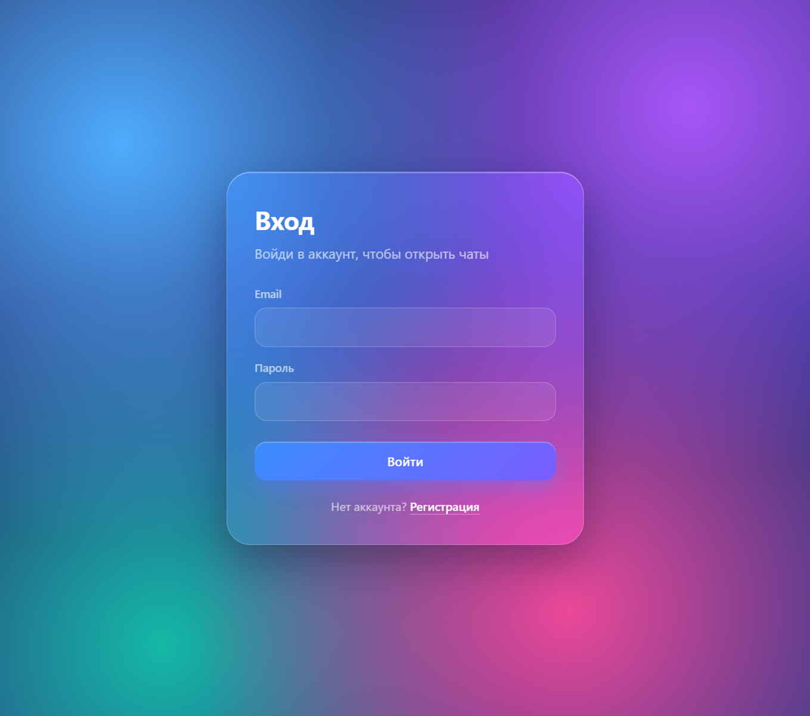
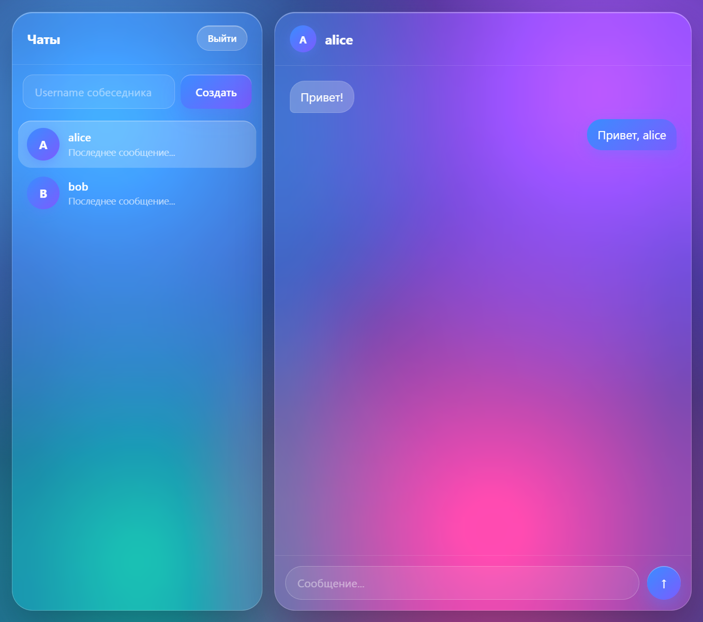
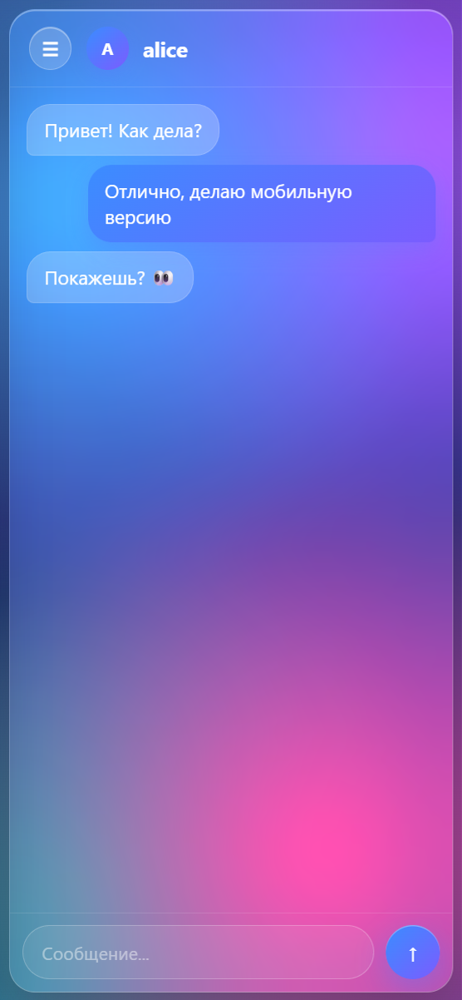

# Messenger

A full-stack one-on-one messenger with a glassmorphism UI inspired by Telegram and iOS.
The backend is a Go REST API backed by PostgreSQL; the frontend is a React + TypeScript single-page app.

| Sign in | Chats | Mobile |
| --- | --- | --- |
|  |  |  |

## Features

- Registration and sign-in with bcrypt-hashed passwords and JWT authentication
- Protected API routes and protected frontend routes
- Sign-out that clears the stored token
- One-on-one chats created by the other user's username, titled with the other participant's name
- Duplicate protection: opening a chat with the same person returns the existing chat
- Chat list persisted per user and loaded on sign-in
- Sending and reading messages, with your own messages highlighted
- Glass-style UI with gradient background
- Collapsible chat list on desktop; on mobile it becomes a slide-out drawer that closes when a chat is opened

## Tech stack

| Layer | Technologies |
| --- | --- |
| Backend | Go, [chi](https://github.com/go-chi/chi) router, [pgx](https://github.com/jackc/pgx), [sqlc](https://sqlc.dev), JWT, bcrypt |
| Database | PostgreSQL, [goose](https://github.com/pressly/goose) migrations |
| Frontend | React 19, TypeScript, Vite, React Router |
| Testing | Go `testing` + `httptest`, Vitest, React Testing Library |
| Tooling | ESLint, Prettier, GitHub Actions |

## Project structure

```
.
├── cmd/app/              # API entry point and route registration
├── internal/
│   ├── auth/             # password hashing and JWT helpers
│   ├── config/           # environment configuration
│   ├── handlers/         # HTTP handlers
│   ├── middleware/       # JWT auth middleware
│   ├── models/           # API response models
│   └── repository/queries/  # sqlc-generated database code
├── sql/
│   ├── migrations/       # goose migrations
│   └── queries/          # SQL queries compiled by sqlc
└── web/                  # React + TypeScript frontend
    └── src/
        ├── api/          # typed API client
        ├── components/   # shared components (ProtectedRoute)
        ├── hooks/        # useMediaQuery
        ├── pages/        # Login, Register, Messenger
        ├── types/        # API types
        └── utils/
```

## Getting started

### Prerequisites

- Go 1.26+
- Node.js 22+
- PostgreSQL
- [goose](https://github.com/pressly/goose) for migrations
- [sqlc](https://sqlc.dev) (only if you change SQL queries)

### 1. Configure the backend

```bash
cp .env.example .env
```

Set `DATABASE_URL` to your PostgreSQL database and `JWT_SECRET` to a long random string.

### 2. Run migrations

```bash
goose -dir sql/migrations postgres "$DATABASE_URL" up
```

### 3. Start the API

```bash
go run ./cmd/app
```

The API listens on `http://localhost:8080`.

### 4. Start the frontend

```bash
cd web
npm install
npm run dev
```

Open `http://localhost:5173`. In development, Vite proxies `/v1/*` requests to the API, so no CORS setup is needed.

To try a conversation, register two users (for example in a normal and a private browser window) and create a chat using the other user's username.

## API

All routes except registration and login require an `Authorization: Bearer <token>` header.

| Method | Route | Body | Description |
| --- | --- | --- | --- |
| `POST` | `/v1/users` | `{ username, nickname, email, password }` | Register a user |
| `POST` | `/v1/login` | `{ email, password }` | Returns `{ token, user }` |
| `GET` | `/v1/users/me` | | Current user |
| `GET` | `/v1/chats` | | Returns `{ chats }` for the current user |
| `POST` | `/v1/chats` | `{ username, name }` | Create a chat, or return the existing one with that user |
| `POST` | `/v1/messages` | `{ chat_id, content }` | Send a message |
| `GET` | `/v1/messages/{chatID}` | | Returns `{ messages }` for a chat you belong to |

Handler errors are returned as `{ "error": "message" }`; authentication failures return a plain-text `401`.

## Testing

Backend:

```bash
go test ./cmd/... ./internal/...
```

The Go tests cover password hashing, JWT generation and validation, the auth middleware, JSON response helpers, and request validation in the handlers.

Frontend:

```bash
cd web
npm run test:run     # single run
npm test             # watch mode
npm run test:coverage
```

The frontend tests cover routing and the protected route redirect, the login flow, chat titles, sign-out and the collapsible chat list on the messenger page, the API client, and chat helpers.

GitHub Actions runs linting, both test suites, and the production build on every push and pull request.

## Regenerating database code

After editing files in `sql/queries/`:

```bash
sqlc generate
```

## Roadmap

- Real-time delivery with WebSockets
- Last message preview and sorting chats by activity
- Token refresh
- Docker Compose setup
- Integration tests against a real PostgreSQL instance
